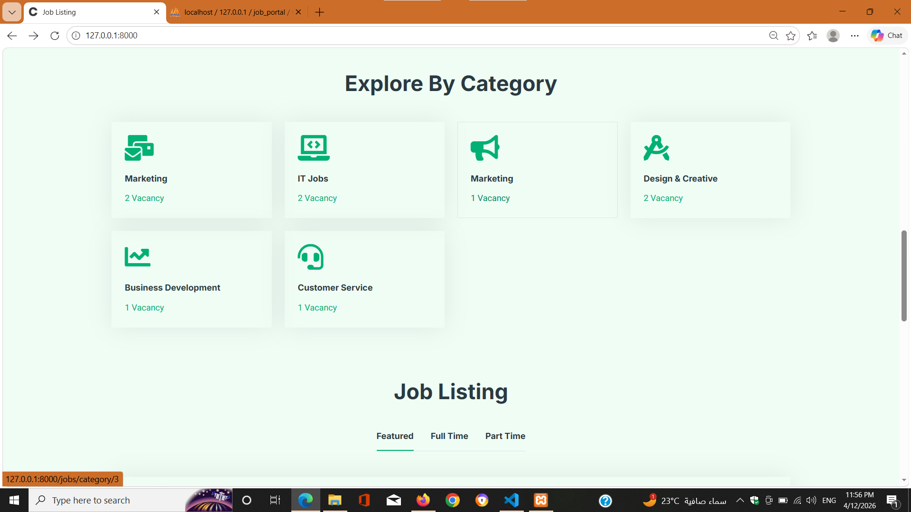
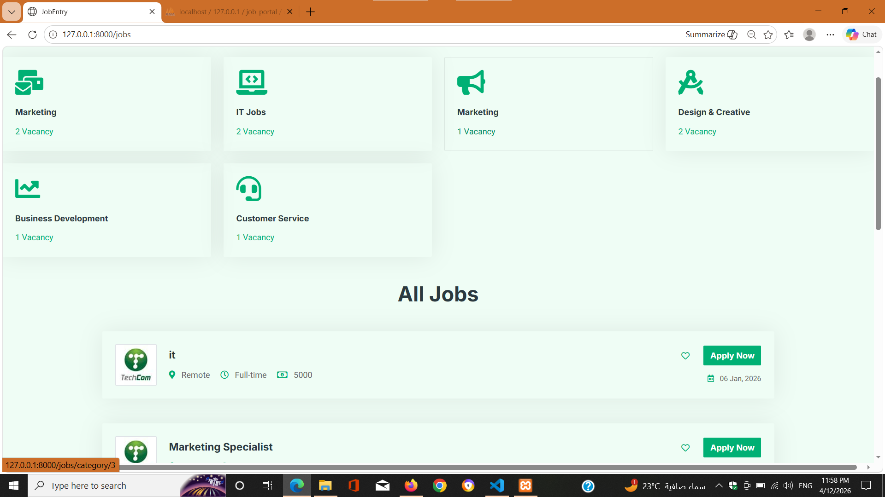
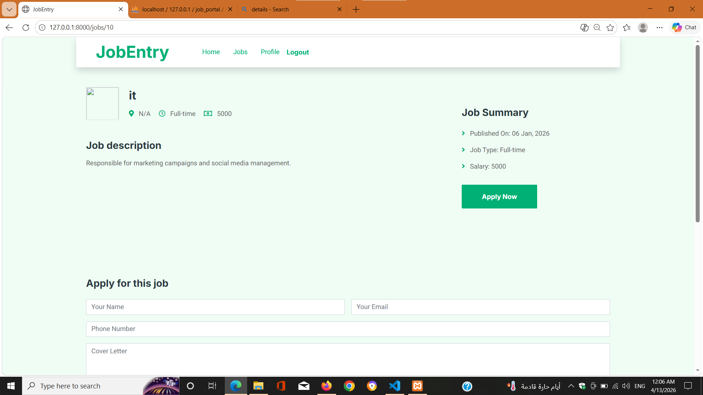
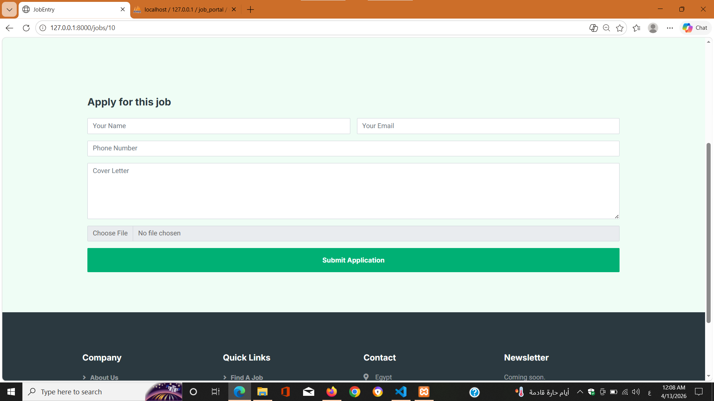
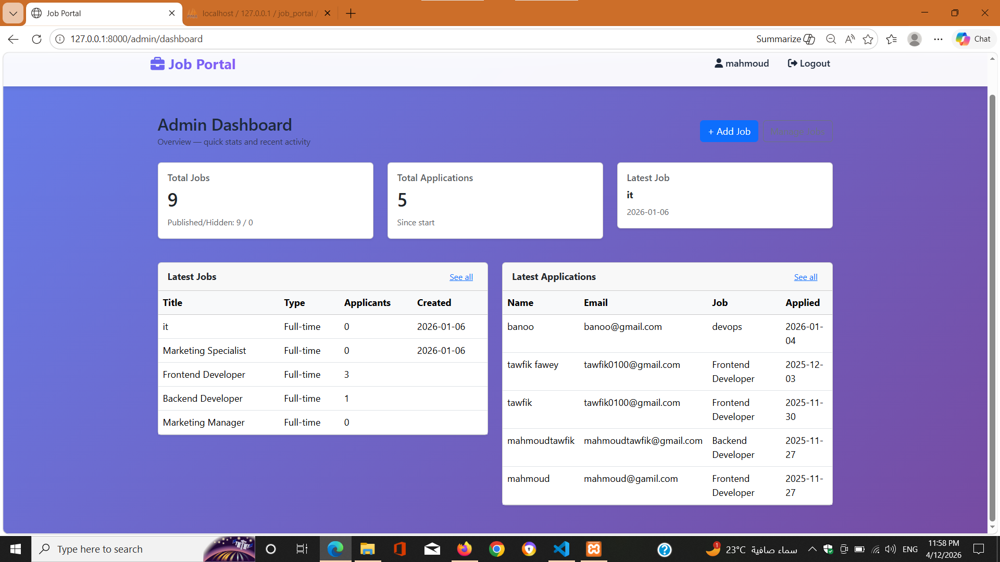

# Job Portal System

A full-featured Job Portal system built with Laravel that allows employers to post jobs and track applicants efficiently.
---

## 🚀 Features

- User authentication (Register / Login)
- Employers can create, update, and delete job posts
- Job seekers can browse and apply for jobs
- Track number of applicants per job
- Admin dashboard for managing jobs and users
- Role-based system (Admin / User)

---

## 🛠️ Tech Stack

- PHP
- Laravel
- MySQL
- Blade
- Bootstrap

---

## 📸 Screenshots
### Home Page


### Home Page (Alternative View)

### Job Listings


### Job Details


### Applications


### Dashboard

---

## ⚙️ Installation

```bash
git clone https://github.com/mahmoudtawfik1998/job-portal-laravel.git
cd job-portal-laravel
composer install
cp .env.example .env
php artisan key:generate
php artisan migrate
php artisan serve


## 📌 Project Highlights
- Implemented job application workflow
- Track number of applicants per job
- Role-based system (Admin / User)
- Dynamic job management system


📬 Contact
Mahmoud Tawfik
Laravel Backend Developer
GitHub: https://github.com/mahmoudtawfik1998
